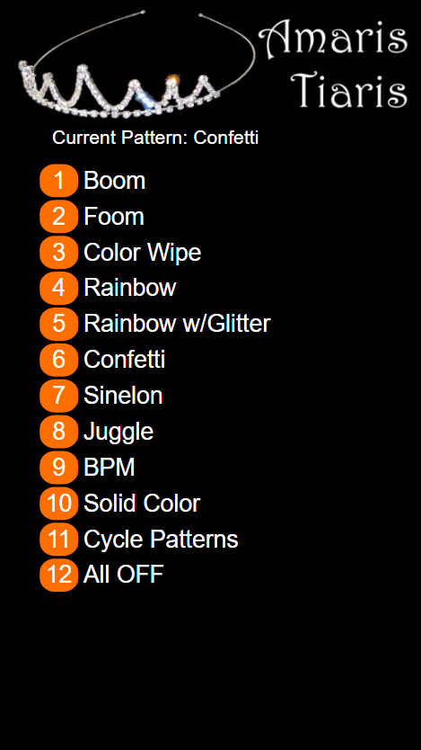
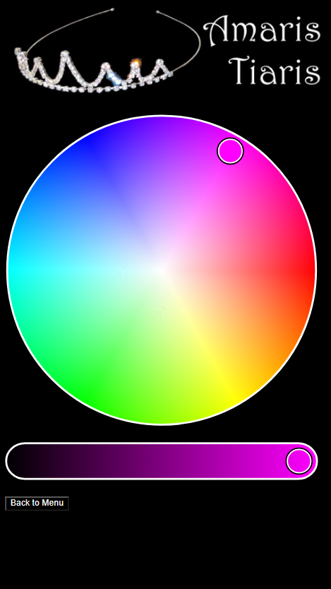

# Tiara
Neopixel Tiara w/WiFi Control UI

This project was inspired by [Becky Stern's](https://beckystern.com/) [NeoPixel Tiara](https://learn.adafruit.com/neopixel-tiara), with some changes to the hardware.
The control board is an ESP8266 [D1 Mini](https://www.wemos.cc/en/latest/d1/d1_mini.html) combined with a [Battery Shield](https://www.wemos.cc/en/latest/d1_mini_shield/battery.html).  Software was written using the Arduino IDE.

The "gems" in the Tiara are from AliExpress; [small](https://www.aliexpress.com/item/33026835790.html) "gem" & [large](https://www.aliexpress.com/item/32835427711.html) "gem".

The software uses the [FastLED](https://github.com/FastLED/FastLED) library and borrows most of the animations from the Demo100 example project included with the library.
I've added two of my own animations customized for the tiara, as well as some minor code to change the sequence of the leds in the animations instead of their actual physical order.  This was then combined with the Captive Portal example from the ESP8266 Arduino library.  The color picker code is using [IRO.js](https://iro.js.org) Javascript code.

The board will appear as a WiFi access point in captive portal mode meaning that once connected, all DNS queries will resolve to the IP address of the control board. If your device does not show this page after connection, it can be accessed with the URL: http://172.217.0.1/42.  The user interface consists of two web pages, the first and main page provides a list of the available animation patterns and the second is a color picker for setting all the led "gems" to a single color.  The current pattern being animated will be displayed at the top of the page and will update automatically as the patterns cycle.

The default is to cycle through each of the animation patterns, allowing each one to run for approximately 10 seconds and then repeating.  Once a pattern is selected it will run until another pattern is selected or until pattern cycling is re-enabled.  Choosing the "Solid Color" option will open the color picker and any color from the color picker wheel can be selected.  It is possible to drag a finger to select colors, but this can generate a large number of color change requests to the control board and will result in some delay before the color of the led "gems" catches up.  It is best to tap rather than drag your finger on the display.

Pattern Selection | Color Picker
---|---
 | 
